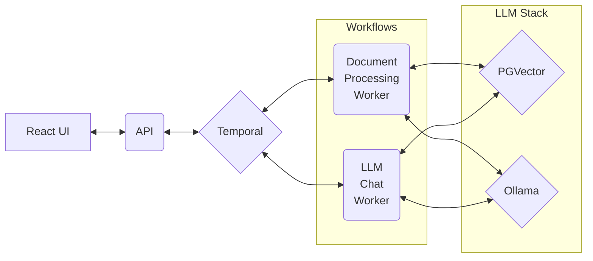

# Demo of Spring AI and Temporal using RAG

This demo is meant to be a starting point for someone interested in using [Temporal](https://temporal.io/)
and [Spring AI](https://spring.io/projects/spring-ai) to query LLMs using Retrieval Augmented Generation (RAG). It is intentionally bare bones
to provide just an example of the interaction between Temporal, Spring and Spring AI.

The following diagram shows the interaction between the various parts of the system:



Please note that the "LLM Section" in the above is for convenience and could be any number of Vector stores or LLM
API providers. The same goes for Temporal, this demo can be configured to use Temporal Cloud instead of running a
local instance.

## Stacks Used

Backend Stack
* [Spring Boot](https://spring.io/projects/spring-boot)
* [Spring AI](https://spring.io/projects/spring-ai)
* [Temporal Java SDK](https://docs.temporal.io/develop/java)

LLM Stack
* [Ollama](https://ollama.com/)
* [PGVector](https://github.com/pgvector/pgvector)

Frontend Stack
* [Vite](https://vite.dev/)
* [React](https://react.dev/)
* [Assistant UI](https://github.com/assistant-ui/)

## Setup

The following assumes that everything will be running locally on a single machine but that is not a requirement. The
appropriate properties needed to change where things run are called out in each section.

<details>

<summary>Run Ollama</summary>

The configuration included expects to find Ollama running locally and populated with two models: *nomic-embed-text* 
and *llama3.1:8b*. See the __spring.ai.ollama.*__ sections of the pipeline __application.properties__ file.

See the [Ollama](https://github.com/ollama/ollama?tab=readme-ov-file#ollama) documentation for information on
how to run Ollama locally.

To fetch the models needed and run Ollama, use the following commands:
```shell
ollama pull nomic-embed-text
ollama pull llama3.1:8b
ollama serve
```

Note that you will need about 4G of disk space in total for the above models.

</details>

<details>

<summary>Run Temporal</summary>

The configuration included expects the Temporal server to be running locally. See the __spring.temporal.*__ sections
of the __application.properties__ files.

The quickest way to get Temporal running is to use the instructions found in the *Install the Temporal CLI* and 
*Local dev server* sections of the 
[Java Background Check tutorial](https://learn.temporal.io/tutorials/java/background-check/project-setup/)

For instance if you are using a Mac this could be as easy as the following:
```shell
brew install temporal
temporal server start-dev
```

</details>

<details>

<summary>Run PGVector in a container</summary>

The configuration included expects to find PGVector running locally. See the __spring.datasource.*__ and 
__spring.ai.vectorstore.*__ sections of the pipeline __application.properties__ file.

For the demo this is the command used to create the database "rag" and a user "rag-user" with a password of "password":
```shell
docker run -d -p 5432:5432 \
    -e POSTGRES_DB=rag \
    -e POSTGRES_USER=rag-user \
    -e POSTGRES_PASSWORD=password \
    pgvector/pgvector:pg17
```
For even more information see [PGVector on Docker](https://github.com/pgvector/pgvector?tab=readme-ov-file#docker)

</details>

<details>

<summary>Run the UI</summary>

The UI will be available at http://localhost:5173/ and the API has CORS configured to accept requests only from 
that URL so be aware that if you change where this runs you will need to update the CORS configuration in the API
as well.

```shell
cd rag-ui
npm install
npm run dev
```
</details>

<details>

<summary>Run the API</summary>

Note that the API will be running on port 8080 once it is started.

```shell
cd rest-api
mvn spring-boot:run
```
</details>

<details>

<summary>Run the Workflows</summary>

```shell
cd pipeline
mvn spring-boot:run
```
</details>

## Details

### Workflows and Activities

The following workflow activities leverage information that is detailed in the
[Spring AI RAG](https://docs.spring.io/spring-ai/reference/api/retrieval-augmented-generation.html)
documentation. Please reference that for details on the specific calls made.

__LLMQueryWorkflow__

This workflow represents a chat query to the LLM. It has a single activity that will execute the query along with 
the user's past content via [Chat Memory](https://docs.spring.io/spring-ai/reference/api/chat-memory.html) and any
relevant information found in the Vector database. The response is stored in a variable that can be queried.

* __LLMQueryActivity__ - This activity is responsible for pulling together the user's input, the user's history and any relevant information found in the Vector database then sending that as a request to the LLM.

__RAGProcessingWorkflow__

This workflow represents the RAG input pipeline. It will first execute a content URL fetch activity to download the
given content and assuming that works successfully will use a second activity to store the content into a Vector 
database. A status is updated at each step in the workflow to indicate the progress made in the process.

This workflow has been tested with HTML although other types of content, like PDFs, should work. For an example of a 
failed workflow make a request with a content URL that is invalid such as xyz://nothing.com/nothing.html, this will
cause the __ResourceFetchActivity__ to fail and end the workflow.

* __ResourceFetchActivity__ - This activity is responsible for fetching the content URL and storing it to disk. Note that this activity may take a long time when running with a local Ollama configuration, the workflow is set to give it 120 seconds to finish.
* __LLMEmbeddingActivity__ - This activity is responsible for extracting the text from content stored on disk, splitting it into tokens and then storing the results in the Vector database.

### API controllers

AdminActionController

* POST /admin/add-resource - Initiates the __RAGProcessingWorkflow__ workflow with a content URL to process. Returns a workflow ID to be used in the following GET request.
* GET /admin/resource/{workflowId}/status - Queries the __RAGProcessingWorkflow__ workflow for the current processing status.

UserActionController

* PATCH /chat - Initiates the __LLMQueryWorkflow__ workflow with a query and a conversation ID. Returns a workflow ID to be used in the following GET request.
* GET /chat/{workflowId} - Queries the __LLMQueryWorkflow__ workflow for a response.

Example API interaction using curl:
```shell
# Make a user chat request
curl -X PATCH -H "Content-Type: application/json" -d '{"userMessage":"tell me a joke", "conversationId":"1234-abc"}' http://localhost:8080/chat
curl -H "Content-Type: application/json" http://localhost:8080/chat/1836441a-0c5c-405f-8780-9df5533e708b

# Make an admin process resource request
curl -X POST -H "Content-Type: application/json" -d "https://example.com/" http://localhost:8080/admin/add-resource
curl -H "Content-Type: application/json" http://localhost:8080/admin/resource/1836441a-0c5c-405f-8780-9df5533e708b/status
```

### UI

In an attempt to not complicate the demo the UI has both admin and user facing parts together. Ideally the ability to
add new content URLs would be something that only an administrator would be able to do and that is why they API 
endpoints are separated as they are.

The chat area leans heavily on the Assistant UI framework. The Thread component on down is specifically created by the
framework and slightly modified for the demo. The main interface between the Assistant UI and the demo chat 
functionality can be found in DemoChatAdapter in the App.tsx file. 

The DemoChatAdapter adapter handles creating and storing a conversationId that is used by the server to manage the 
conversation history of a given user. It also handles local commands that start with a forward slash and general chat 
queries. The general queries that go to the server first send a PATCH request to the /chat endpoint with the 
conversationId and the user's query and get back a workflowId. That workflowId is then used in a loop that polls the 
/chat/{workflowId} endpoint with GET requests until a value is returned or a timeout is reached.

To augment the system with new content there is an admin modal that launches when the user clicks the "Add Content" 
button at the top of the screen. That modal can be found in the component AdminModal in admin-modal.tsx file. This
modal component takes in a URL for the content to fetch and use in the RAG pipeline. That content URL is sent to the
/admin/add-resource API endpoint via a POST and stores the returned workflowId. It then uses the workflowId to poll
the /resource/{workflowId}/status endpoint with GET requests and show the status returned until the status is either
DONE or FAILED.

## Other Notes

* This is a good [Spring AI intro video](https://www.youtube.com/watch?v=6Pgmr7xMjiY) although a few things have changed since it was created so refer to the documentation.
* Temporal has a [Spring Boot Tutorial](https://learn.temporal.io/tutorials/java/build-an-email-drip-campaign/) that is a good reference point for more detail on the Spring integration.


